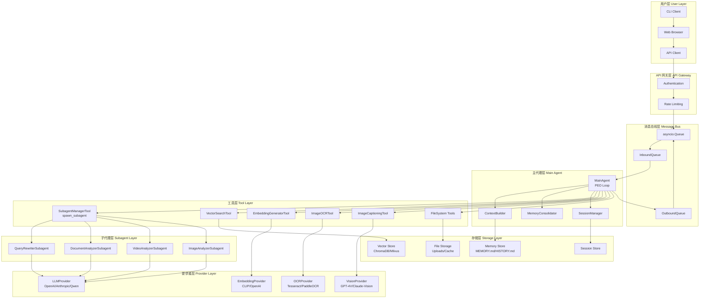
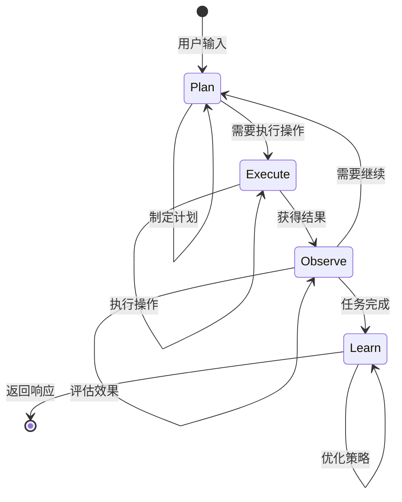
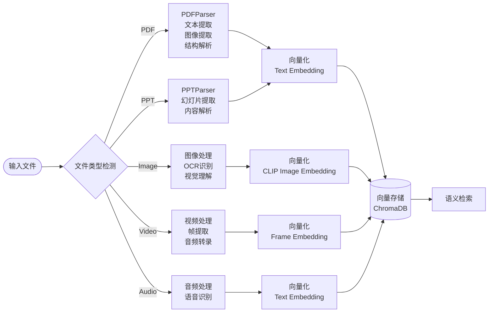
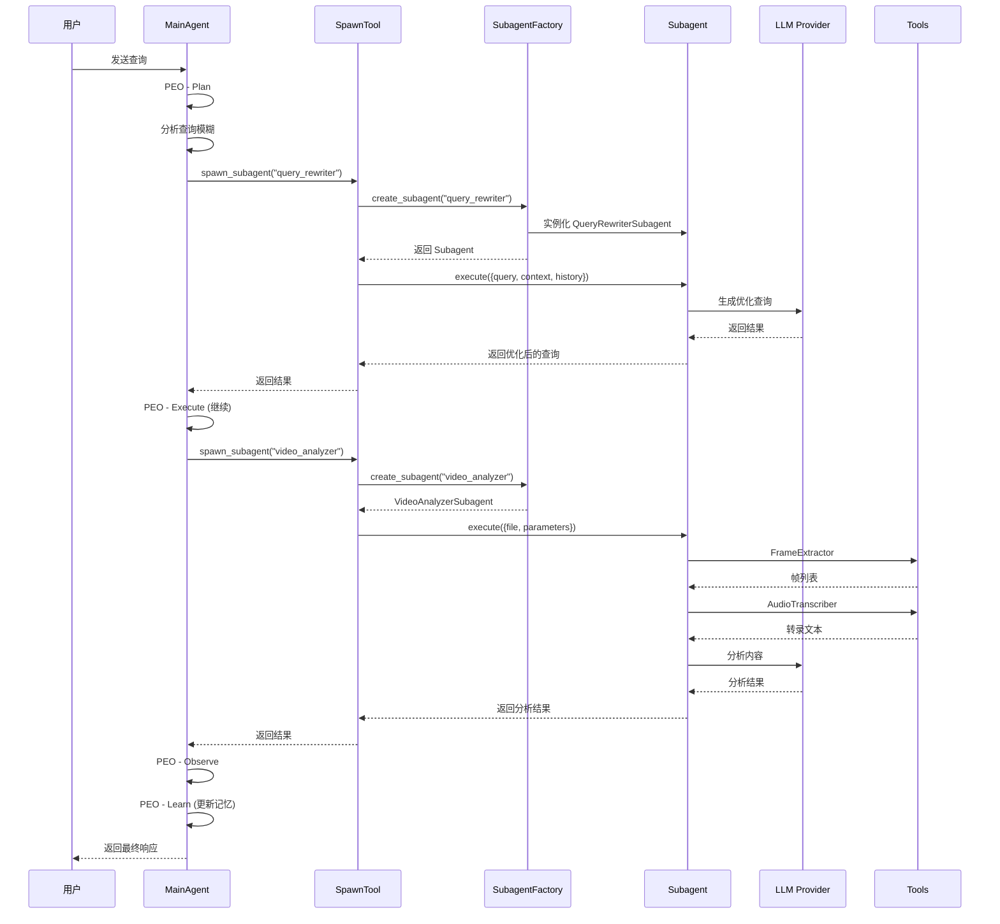
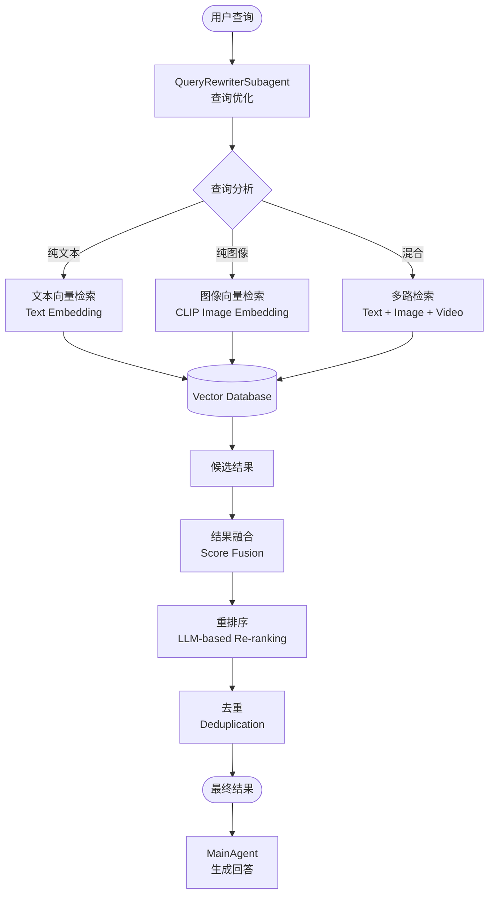
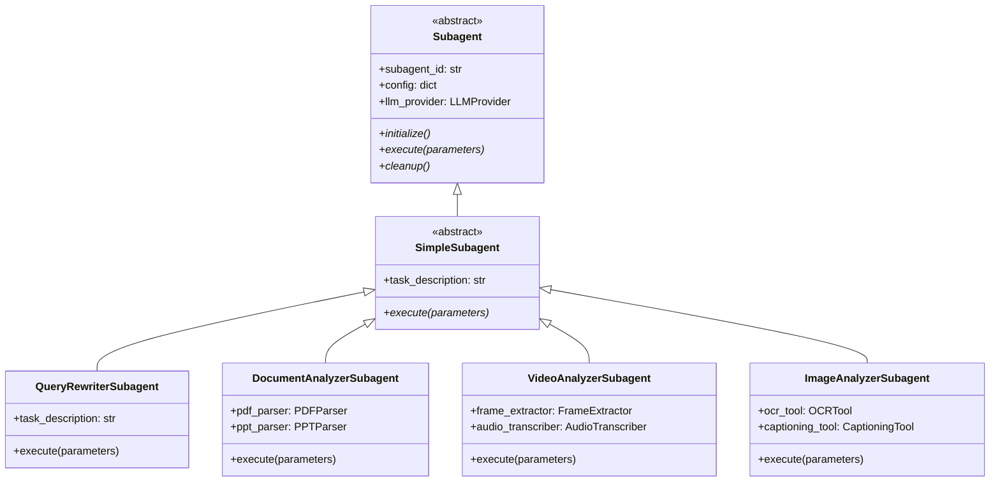
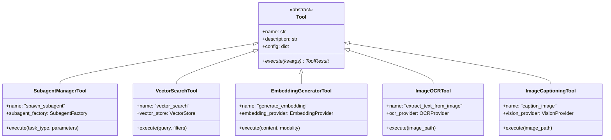
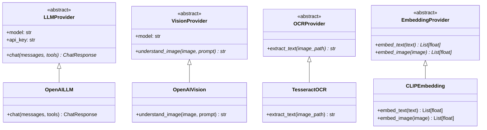
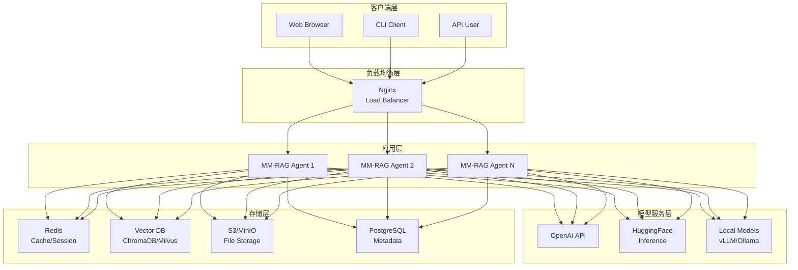

# MM-RAG Agent 架构图 (Mermaid 版本)

## 1. 系统总体架构

---

## 2. PEO 循环流程图

---

## 3. 多模态处理流水线

---

## 4. MainAgent 与 Subagent 交互

---

## 5. 跨模态检索流程

---

## 6. 子代理类图

---

## 7. 工具类图

---

## 8. 提供者类图

---

## 9. 部署架构

---

## 使用说明

以上 Mermaid 图表可以在以下平台渲染：

1. **GitHub** - 直接在 README.md 中显示
2. **VS Code** - 安装 "Markdown Preview Mermaid Support" 插件
3. **Typora** - 原生支持 Mermaid
4. **在线编辑器** - https://mermaid.live/
