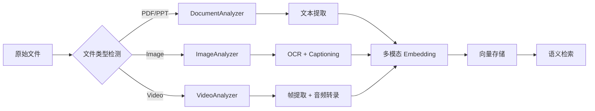

# MM-RAG-Agent

> **An Agentic Multimodal RAG System** - 专为多模态检索增强生成设计的智能代理系统

## 项目愿景

MM-RAG-Agent 是一个面向多模态内容的智能检索与生成系统。与传统文本 RAG 不同，我们致力于处理 **Text + Image + Video + Audio + Document** 的复合场景，让 AI 能够像人类一样理解和处理多媒体信息。

## 核心设计理念

### 1. 分层处理架构

```
┌─────────────────────────────────────────────────────────────────┐
│                        用户查询 (User Query)                      │
└────────────────────────────┬────────────────────────────────────┘
                             │
                             ▼
┌─────────────────────────────────────────────────────────────────┐
│                      MainAgent (主协调层)                         │
│  • PEO 循环 (Plan-Execute-Observe)                               │
│  • 查询理解与任务分解                                             │
│  • 工具/子代理调度决策                                            │
└────────────────────────────┬────────────────────────────────────┘
                             │
                ┌────────────┴────────────┐
                │                         │
                ▼                         ▼
┌───────────────────────────┐  ┌─────────────────────────────────┐
│   Tool Layer (工具层)      │  │  Subagent Layer (子代理层)       │
│                           │  │                                 │
│ • 简单、原子操作           │  │ • 复杂、多步骤任务               │
│ • 无状态、快速响应         │  │ • 有状态、深度处理               │
│ • 直接被 LLM 调用          │  │ • 独立生命周期管理               │
│                           │  │                                 │
│ EmbeddingGeneratorTool    │  │ DocumentAnalyzerSubagent        │
│ VectorSearchTool          │  │ VideoAnalyzerSubagent           │
│ ImageOCRTool              │  │ ImageAnalyzerSubagent           │
│ ImageCaptioningTool       │  │ QueryRewriterSubagent           │
└───────────────────────────┘  └─────────────────────────────────┘
                │                         │
                └────────────┬────────────┘
                             ▼
┌─────────────────────────────────────────────────────────────────┐
│                    Provider Layer (模型抽象层)                    │
│                                                                 │
│  ┌──────────────┐  ┌──────────────┐  ┌──────────────┐          │
│  │ LLMProvider  │  │ VisionProvider│ │ OCRProvider  │          │
│  │ (文本理解)    │  │ (视觉理解)     │ │ (文字识别)    │          │
│  └──────────────┘  └──────────────┘  └──────────────┘          │
│                                                                 │
│  ┌──────────────┐  ┌──────────────┐                            │
│  │EmbeddingProv.│  │ AudioProvider │                            │
│  │ (向量化)      │  │ (语音处理)     │                            │
│  └──────────────┘  └──────────────┘                            │
└─────────────────────────────────────────────────────────────────┘
```

### 2. 多模态处理流水线



### 3. Tool vs Subagent 设计决策

| 维度 | Tool | Subagent |
|------|------|----------|
| **生命周期** | 单次调用 | 独立会话 |
| **状态管理** | 无状态 | 有状态 |
| **复杂度** | 简单原子操作 | 多步骤编排 |
| **示例** | `vector_search("query")` | `DocumentAnalyzer.analyze(file,深度分析)` |

**设计原则**：
- **能做成 Tool 的就不做成 Subagent** - 保持轻量
- **需要多步协调的任务用 Subagent** - 保证专业度

### 4. Provider 抽象设计

```python
# 统一的 Provider 接口设计
class LLMProvider(ABC):
    @abstractmethod
    async def chat(self, messages, tools=None) -> ChatResponse:
        """文本对话生成"""

class VisionProvider(ABC):
    @abstractmethod
    async def understand_image(self, image_path, prompt) -> str:
        """图像理解与描述"""

class OCRProvider(ABC):
    @abstractmethod
    async def extract_text(self, image_path) -> str:
        """文字识别"""

class EmbeddingProvider(ABC):
    @abstractmethod
    async def embed_text(self, text: str) -> List[float]:
        """文本向量化"""

    @abstractmethod
    async def embed_image(self, image_path: str) -> List[float]:
        """图像向量化"""
```

### 5. 多模态 RAG 检索策略

```
查询输入
    │
    ▼
QueryRewriterSubagent (查询优化)
    │
    ├─► 意图识别
    ├─► 同义词扩展
    └─► 多模态转换
    │
    ▼
多路并行检索:
    ├─► 文本向量检索 (VectorSearchTool)
    ├─► 图像语义检索 (Embedding + ANN)
    └─► 元数据过滤 (文件类型/时间/来源)
    │
    ▼
结果融合与排序
    │
    ▼
MainAgent 生成回答
```

## 多模态能力矩阵

| 输入类型 | 提取能力 | 向量化 | 检索能力 | 分析能力 |
|---------|---------|--------|---------|---------|
| 📄 文本 | ✅ 原生读取 | ✅ 文本 Embedding | ✅ 语义搜索 | ✅ LLM 理解 |
| 🖼️ 图像 | ✅ OCR 识别 | ✅ Vision Embedding | ✅ 图文互检索 | ✅ 视觉理解 |
| 📹 视频 | ✅ 帧+音频提取 | ✅ 帧/音频 Embedding | ✅ 场景检索 | ✅ 内容分析 |
| 📊 PDF | ✅ 内容解析 | ✅ 文本 Embedding | ✅ 文档检索 | ✅ 结构理解 |
| 📽️ PPT | ✅ 幻灯片提取 | ✅ 文本 Embedding | ✅ 页面检索 | ✅ 演示分析 |

## 与传统 RAG 的对比

| 特性 | 传统 RAG | MM-RAG-Agent |
|------|---------|--------------|
| **数据类型** | 仅文本 | Text + Image + Video + Audio |
| **索引方式** | 单一向量 | 多模态向量 + 元数据 |
| **检索能力** | 文本语义匹配 | 跨模态语义理解 |
| **理解深度** | 文本内容 | 多媒体内容联合理解 |
| **应用场景** | 文档问答 | 多媒体知识库、视频分析、图文检索 |

## 项目结构

```
mm_rag_agent/
├── config/                  # 配置管理
│   ├── schema.py           # Pydantic 配置模型
│   └── __init__.py
│
├── providers/               # 模型提供者抽象层
│   ├── base.py             # Provider 基类定义
│   ├── openai.py           # OpenAI 实现 (GPT-4V, DALL-E, Whisper)
│   ├── huggingface.py      # HuggingFace 实现 (CLIP, Tesseract, etc.)
│   └── __init__.py
│
├── bus/                     # 消息通信总线
│   ├── events.py           # InboundMessage, OutboundMessage
│   ├── queue.py            # asyncio.Queue 实现
│   └── __init__.py
│
├── session/                 # 会话管理
│   ├── manager.py          # SessionManager (多会话、持久化)
│   └── __init__.py
│
├── agent/                   # Agent 核心逻辑
│   │
│   ├── context/             # 上下文构建
│   │   ├── builder.py      # MMContextBuilder (多模态上下文)
│   │   └── __init__.py
│   │
│   ├── memory/              # 记忆管理
│   │   ├── consolidator.py # MemoryConsolidator (长短期记忆)
│   │   └── __init__.py
│   │
│   ├── skills/              # 内置技能/Prompt
│   │   ├── builtin_skills/ # MM RAG 专用 Prompt 片段
│   │   └── __init__.py
│   │
│   ├── tools/               # 工具系统
│   │   ├── base.py         # Tool 基类
│   │   ├── registry.py     # ToolRegistry
│   │   ├── common/         # 通用工具 (文件、消息等)
│   │   ├── multimodal/     # 多模态工具 (OCR、Captioning、Embedding、VectorSearch)
│   │   ├── document/       # 文档工具 (PDF、PPT 解析)
│   │   ├── video/          # 视频工具 (帧提取、音频转录)
│   │   └── subagent_manager.py  # Subagent 管理工具
│   │
│   ├── subagents/           # 专业子代理
│   │   ├── base.py         # Subagent 基类
│   │   ├── query_rewriter.py    # 查询重写
│   │   ├── document_analyzer.py # 文档分析
│   │   ├── video_analyzer.py    # 视频分析
│   │   └── image_analyzer.py    # 图像分析
│   │
│   └── main_agent.py       # 主 Agent (PEO 循环)
│
├── workspace/               # 工作目录
│   ├── uploads/            # 上传文件
│   ├── vector_store/       # 向量数据库
│   └── memory/             # 记忆存储
│
├── main.py                  # 系统入口
├── requirements.txt         # 依赖
└── README.md
```

## 快速开始

### 安装

```bash
# 克隆项目
git clone https://github.com/Chenshilei2025/mm-rag-agent.git
cd mm-rag-agent

# 安装依赖
pip install -r requirements.txt

# 配置环境变量
cp .env.example .env
# 编辑 .env 文件，填入你的 API Keys
```

### 配置

```bash
# .env 文件配置示例

# LLM 配置
LLM_PROVIDER=openai
LLM_MODEL=gpt-4o
OPENAI_API_KEY=sk-xxx

# 视觉模型
VISION_PROVIDER=openai
VISION_MODEL=gpt-4o

# OCR 配置
OCR_PROVIDER=tesseract  # 或 openai

# Embedding 配置
EMBEDDING_PROVIDER=openai
EMBEDDING_MODEL=text-embedding-3-large
IMAGE_EMBEDDING_MODEL=clip-ViT-B-32

# 向量存储
VECTOR_STORE_TYPE=chroma  # 或 milvus, faiss
VECTOR_STORE_PATH=./workspace/vector_store
```

### 运行

```bash
# CLI 模式
python -m mm_rag_agent.main --mode cli

# API 服务器模式
python -m mm_rag_agent.main --mode api --host 0.0.0.0 --port 8000
```

### API 使用示例

```python
import httpx

async def chat_with_mm_rag(message: str, images: list[str] = None):
    """与多模态 RAG Agent 对话"""
    async with httpx.AsyncClient() as client:
        response = await client.post(
            "http://localhost:8000/chat",
            json={
                "message": message,
                "images": images,  # 可选：附带图片
                "session_id": "user_session_123"
            }
        )
        return response.json()

# 使用示例
result = await chat_with_mm_rag(
    "这个视频里讲了什么内容？",
    images=["path/to/video_thumbnail.jpg"]
)
```

## 应用场景

- **多媒体知识库问答** - 在包含图片、视频的文档中检索答案
- **视频内容分析** - 理解视频内容、提取关键信息
- **图文智能检索** - 用图像搜索相关文本，或用文本搜索相关图像
- **演示文稿分析** - 理解 PPT 内容并生成摘要
- **多模态对话** - 支持图片、视频输入的智能对话

## 设计亮点

1. **真正的多模态统一处理** - 不是简单拼接，而是深度的多模态理解
2. **专业化的 Subagent 设计** - 每种媒体类型有专门优化的处理流程
3. **灵活的 Provider 抽象** - 可轻松切换不同的模型提供商
4. **清晰的架构分层** - Tool/Subagent 各司其职，易于扩展
5. **生产级设计** - 会话管理、记忆归档、错误处理等完备

## 贡献指南

欢迎提交 Issue 和 Pull Request！

## License

MIT License
